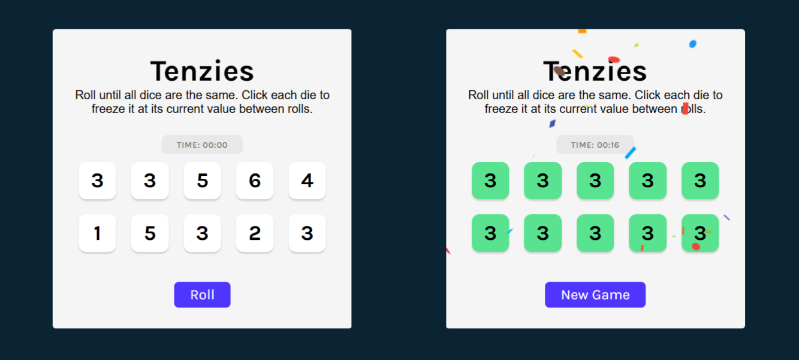

# Tenzies 🎲

[](https://spectacular-biscuit-3ae0e8.netlify.app/)

> Click the image to view the demo. The link will open in the current tab (press `Ctrl + Click` or `Cmd + Click` to open in a new tab).


## Description

**Tenzies** is a dice game built with React. Roll the dice, freeze the ones you want to keep, and keep rolling until all ten dice show the same number. A timer and roll counter track your performance — beat your best! 🎉

This project was created to practice React fundamentals, hooks, refs, and building an interactive game with clean UI.

## How to Play

1. Roll the dice
2. Click any die to **freeze** it at its current value
3. Keep rolling until **all ten dice match**
4. Try to win in as few rolls and as little time as possible!

## Features

- **Dice with Pips** — dice look like real dice instead of showing numbers
- **Freeze Mechanic** — click a die to hold it between rolls; click again to unfreeze
- **Timer** — starts on your first roll, stops when you win
- **Win Summary** — shows your final time on victory
- **New Game** — instantly resets everything for another round
- **Confetti** 🎉 — fires when you win
- **Accessible** — keyboard navigable, screen reader announcements, ARIA labels on every die

## Technologies Used

- **React 19** – Component-based UI with hooks (`useState`, `useEffect`, `useRef`)
- **Vite** – Build tool and dev server
- **nanoid** – Unique IDs for each die
- **react-confetti** – Confetti animation on win
- **CSS3** – Custom styling with grid, flexbox, and transitions
- **Google Fonts** – Karla typography

## What I Practiced

- Managing multiple pieces of game state with `useState`
- Running a live interval timer with `useEffect` and `useRef`
- Using `useRef` to programmatically focus a button on game win
- Conditional rendering and dynamic class names
- `visibility: hidden` vs `display: none` for layout-stable UI
- Accessibility: `aria-pressed`, `aria-label`, `aria-live` regions

## Getting Started

### Prerequisites

- Node.js (v18 or higher)
- npm

### Installation

1. Clone the repository:

```bash
git clone https://github.com/yourusername/tenzies-game.git
cd tenzies
```

2. Install dependencies:

```bash
npm install
```

3. Start the development server:

```bash
npm run dev
```

4. Open your browser and navigate to `http://localhost:5173`
